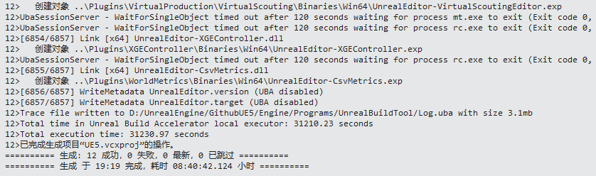
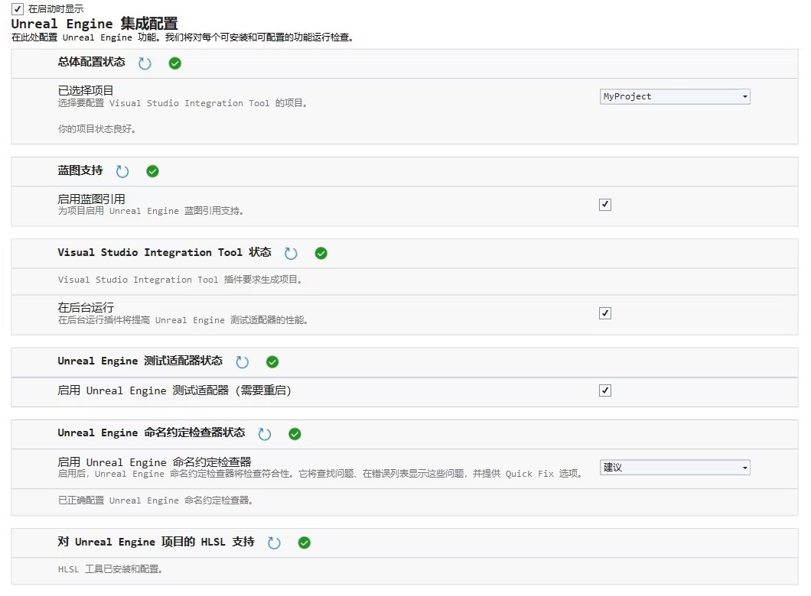
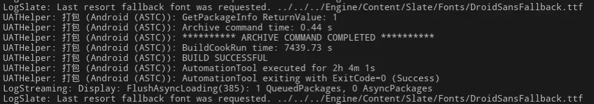

# UnrealEngine 编译

1. 拉取源码 `https://github.com/EpicGames/UnrealEngine.git`
2. 签出分支 `git checkout tags/x.x.x-release`
3. 按照 `README.md` 运行 `Setup.sh`
4. 如果是 `UE4.27.2` 额外替换文件 [Commit.gitdeps.xml](https://github.com/EpicGames/UnrealEngine/releases/tag/4.27.2-release)
5. 运行 `GenerateProjectFiles.bat`
6. 打开 `UE5.sln`, 设 `UE5` 为启动项目, 配置 `Development Editor` 平台 `Win64`
7. 开始生成 :coffee:






# Android 打包

1. 安装 [Android Studio](https://developer.android.com/studio/archive)
2. 按照引擎需要下载 `SDK`, `NDK`, `Java`,
3.  `UE5` 按照说明配置相应的 `SDK`, `NDK NDK r25b` 和 `Java 17`, `Build-Tool 34`
4. `UE4.27.2` 配置 `Java 8`, 不然报错 `Gradle`, `NDK r21b`, `Build-Tool 29`
5. 简单项目勾选将游戏数据打包在内, 否则真机运行报错无文件权限
6. `UE5` 不支持 `OpenGLES 3.1` 所以不能在模拟器上跑, `MUMU` 据说支持 `Vulkan` 但是运行崩溃
7. 打包到 `Android Studio` 的模拟器上运行需要勾选支持 `x86_64`
8. 开始打包 :coffee:




# 基本概念入门

## 游戏引擎

1. UnrealEngine
2. Unity
3. CryEngine
4. Source2
5. NaughtyDog GameEngine
6. RockstarAdvanced GameEngine
7. AnvilNext2
8. IW Engine

## 渲染

- [GAMES101](https://sites.cs.ucsb.edu/~lingqi/teaching/games101.html)

## 物理

- [Havok](https://www.havok.com/)
- [PhysX](https://github.com/NVIDIAGameWorks/PhysX)
- [Bullet3](https://github.com/bulletphysics/bullet3)

# UnrealEngine 基本使用

## 快捷键

- `F` : 将相机聚焦
- `End` : 中心贴地
- `Alt + End` ： 轴心贴地
- `Shift + End` : 碰撞盒贴地

## 目录结构


最外层目录

```
/Engine    - All code, content & configuration for the Engine
/Samples   - StarterContent
/Templates - Templates for creating new projects
```

`/Engine` 和 `/MyProject` 内部目录
```
/Binaries           - Executables & DLLs for the Engine
/Build              - Files needed for building the Engine
/Config             - Configuration files
/Content            - Shared Engine content
/DerivedDataCache   - Cached content data files
/Intermediate       - Temporary build products
/Plugins            - Shared and project specific plug-ins
/Saved              - Autosaves, local configs, screenshots, etc.
/Source             - Source code for all the things!
```


## 模块 `Module`

`Module` 类型
```
Developer   - Code for additional tools (output log, source control, profiling, cooking, derived data cache, ...)
Editor      - Code for implementing the Unreal Editor. Many systems have separate Runtime and Editor modules.
Runtime     - Code needed while the game is running
ThirdParty  - External code from other companies
Plugins     - Extensions for Editor, Games, or both
Programs    - Build and header tools, lightmass light baking, shader compiler, ...
```

`Module` 依赖规则
```
Runtime modules must not have dependencies to Editor or Developer modules
Plug-in modules must not have dependencies to other plug-ins
```


## 蓝图

- `Level Blueprint`
    - 自动生成, 每关卡 1 个
    - 生命周期是关卡存在时间
    - 监听 Level 级别的事件
- `Blueprint Class`
- `Data-Only Blueprint`
- `Blueprint Interface`
- `Blueprint Macros`


## 内置控制台

```
Stat FPS      t.MaxFPS 1000 最高帧率限制到 1000
Stat UNIT                   对游戏线程, 渲染线程, GPU 耗时进行统计, 分析瓶颈
Stat GAME                   对游戏各个模块的 Tick 耗时进行统讨
Stat SceneRendering         渲染基本信息统计, 可以看 DrawCall 数
Stat Engine                 渲染信息统计, 可以看三角形数量
Stat InitViews              视口剔除的三角形数量
Stat RHI                    所有的 DrawCall
```

# 备注

- 引擎主循环入口 `LaunchEngineLoop.cpp`
- `Visual Studio` 中显示完整宽度
```
工具 -> 自定义 -> 命令选项卡 -> 工具栏 -> 标准 -> 解决方案配置
```


